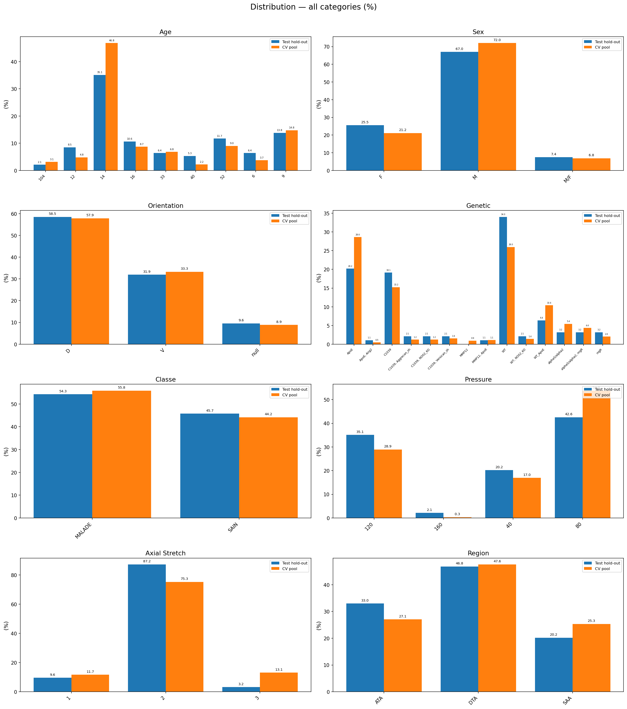

# Rapport d'experimentation -- Classification 3D par deep learning

## 0. Cadre general

### 0.1 Objectif

Le modele effectue une **classification binaire** (SAIN / MALADE) au niveau du **patch** 3D (256x256x32). Chaque patch est predit individuellement, puis les predictions sont **agregees au niveau du stack** (volume complet) par moyenne des probabilites, avec un seuil a 0.5 pour la decision finale.

### 0.2 Metriques

**F1-score par classe :**

Le F1-score est la moyenne harmonique de la precision et du recall. Il est calcule **independamment pour chaque classe** en traitant celle-ci comme la classe positive :

- **F1 SAIN** (F1 classe 0) : TP = vrais SAIN, FP = MALADE predits SAIN, FN = SAIN predits MALADE
- **F1 MALADE** (F1 classe 1) : TP = vrais MALADE, FP = SAIN predits MALADE, FN = MALADE predits SAIN

`F1 = 2 * (precision * recall) / (precision + recall)`

**Metrique principale : val_f1_mean**

La metrique utilisee pour comparer les modeles est le **val_f1_mean**, defini comme la moyenne arithmetique du F1 des deux classes :

`val_f1_mean = (F1_SAIN + F1_MALADE) / 2`

Cette metrique donne un poids egal aux deux classes, meme si le dataset est legerement desequilibre. Le meilleur modele est retenu sur la base du **best val_f1_mean** observe pendant l'entrainement (early stopping).

### 0.3 Demarche en 3 phases

1. **Phase 1 -- Evaluation du preprocessing** : fixer la strategie de preparation des donnees en comparant 9 configurations sur ResNet3D-50.
2. **Phase 2 -- Comparaison d'architectures** : evaluer 9 modeles (CNN et Transformers) sur les 2 meilleurs preprocessings.
3. **Phase 3 -- Cross-validation et test holdout** : valider les meilleurs modeles par 5-fold CV stratifiee, puis test sur un holdout jamais vu.

---

## 1. Split des donnees

### Principe

Le split est applique au niveau des **stacks** (volumes), et non des patches. Tous les patches issus d'un meme stack appartiennent au meme ensemble (train ou test), ce qui evite toute **fuite d'information** entre les ensembles.

### Pipeline de split

Chaque split est genere par un pipeline en 3 etapes :

1. **Filtrage** -- selection des stacks selon des criteres metadonnees :
   - Age (semaines) : min/max configurable
   - Region anatomique (DTA, ATA, SAA)
   - Sexe, orientation (D/V), fond genetique
   - Pression, axial stretch
   - Classe (SAIN / MALADE)

2. **Exclusion** -- retrait de stacks specifiques par identifiant (artefacts visuels, acquisitions incompletes). Exemple : `stack_000163`, `stack_000147`, `stack_000159`, `stack_000090`.

3. **Split stratifie** -- repartition en respectant les distributions sur 8 cles de stratification : age, sexe, region, axial stretch, pression, classe, orientation, fond genetique. Une graine aleatoire (seed) garantit la reproductibilite.

La sortie est un fichier JSON listant les identifiants de stacks pour chaque ensemble, avec les metadonnees du split (filtres, seed, ratios).

### Split simple (Phase 1 & 2)

Pour la comparaison des preprocessings et des architectures, un **split unique train/test (80/20)** est utilise. Plusieurs seeds ont ete testees pour evaluer la robustesse des resultats sur differents splits.

### Split cross-validation (Phase 3)

Pour la validation rigoureuse des modeles, un schema de **cross-validation stratifiee a 5 folds** avec holdout test est utilise :

**Etape 1 -- Holdout test (10%)** : 94 stacks reserves, **jamais utilises** pendant l'entrainement ni la validation. Servent uniquement a l'evaluation finale.

**Etape 2 -- Pool CV (90%)** : 643 stacks restants, repartis en 5 folds stratifies.

| Ensemble | Stacks | Utilisation |
|----------|--------|-------------|
| Test holdout | 94 | Evaluation finale uniquement |
| CV pool total | 643 | Entrainement + validation |
| Fold 0 (val) | 135 | Validation pour le fold 0, train pour les 4 autres |
| Fold 1 (val) | 126 | Validation pour le fold 1, train pour les 4 autres |
| Fold 2 (val) | 124 | Validation pour le fold 2, train pour les 4 autres |
| Fold 3 (val) | 129 | Validation pour le fold 3, train pour les 4 autres |
| Fold 4 (val) | 129 | Validation pour le fold 4, train pour les 4 autres |

Chaque fold entraine sur ~514 stacks (4/5) et valide sur ~129 stacks (1/5). Les 5 sets de validation sont **disjoints** : leur union couvre exactement les 643 stacks du pool CV.

**Distribution des classes :**
- Test holdout : 54.3% MALADE / 45.7% SAIN
- CV pool : 55.8% MALADE / 44.2% SAIN
- Ecart classe entre folds : < 3% (stratification respectee)

### Verification automatique

Un script de verification confirme :
- **Isolation** : aucun stack du holdout test n'apparait dans les folds (15 checks PASS)
- **Disjonction** : les 5 sets de validation sont mutuellement disjoints (10 checks PASS)
- **Couverture** : l'union des 5 val folds = 643 stacks exactement
- **Equilibre** : taille des folds entre 124 et 135 (moyenne 128.6, deviation max 6.4)
- **Distribution** : ecarts < 5% sur toutes les cles de stratification entre folds (sauf 2 alertes mineures sur axial stretch et region DTA)

### Visualisation des distributions

**Distribution par fold (train) :**

**Distribution par fold (validation) :**

**Distribution holdout test :**

---

## 2. Preprocessing

### 2.1 Protocole

Chaque volume 3D (NIfTI) est decoupe en patches de taille `256x256x32`.
Les patches sont initialement sauvegardes au format `.nii.gz`, puis convertis en `.npy` pour accelerer le chargement pendant l'entrainement.

**Modes d'extraction :**
- **MAX** : extrait **tous** les patches possibles du volume selon une grille 4x4, soit 16 patches. Couvre l'integralite du volume sans biais de selection.
- **TOP_N** : extrait tous les patches possibles, puis **ne retient que les N meilleurs** selon le critere de slice selection (ex: les 4 ou 8 patches avec la plus forte intensite moyenne). Reduit le volume de donnees mais peut introduire un biais.

**Deux axes d'optimisation explores :**
- **Slice selection** : methode pour choisir le meilleur bloc de 32 coupes dans le volume (intensity, intensity_range, variance, entropy)
- **Normalisation** : transformation des intensites avant extraction (z-score, min-max, robust, intensity_global, minmax_p1p99, minmax_p5p95)

### 2.2 Resultats (ResNet3D-50, validation set)

9 configurations testees, evaluees sur un split train/val unique :

| Slice Selection | Normalisation | Extraction | F1 HEALTHY | F1 DISEASED |
|----------------|---------------|------------|------------|-------------|
| **intensity** | **intensity_global** | MAX 16 | **0.954** | **0.965** |
| intensity | minmax_p5p95 | MAX 16 | 0.915 | 0.935 |
| intensity | minmax_p1p99 | MAX 16 | 0.913 | 0.933 |
| intensity | minmax_p1p99 | TOP_N 4 | 0.901 | 0.927 |
| intensity_range | min-max | MAX 16 | 0.850 | 0.884 |
| intensity_range | z-score | MAX 16 | 0.853 | 0.878 |
| intensity_range | robust | TOP_N 8 | 0.839 | 0.880 |
| variance | z-score | MAX 16 | 0.830 | 0.855 |
| entropy | z-score | MAX 16 | 0.819 | 0.851 |

### 2.3 Conclusions preprocessing

- La **slice selection par intensite** domine largement les methodes variance et entropy (+12 points F1).
- La **normalisation intensity_global** (basee sur les statistiques globales du dataset) est nettement superieure aux normalisations par-patch (z-score, min-max, robust).
- Le mode **MAX (16 patches)** est plus performant que TOP_N (4 ou 8 patches), car il couvre l'integralite du volume sans biais de selection.

**Deux configurations retenues pour la suite :**

| Preprocess | Slice Selection | Normalisation | Specificite | Justification |
|------------|----------------|---------------|-------------|---------------|
| **intensity_global** | intensity | intensity_global | Normalisation basee sur les stats globales du dataset | Meilleure performance globale |
| **minmax_p1p99** | intensity | minmax_p1p99 | Normalisation per-stack (percentiles 1/99) | Tests complementaires |

---

## 3. Comparaison des modeles

### 3.1 Configuration d'entrainement

**Entree :** patches 256x256x32, repetes sur 3 canaux (grayscale → RGB) pour compatibilite avec les architectures pretrained.

**Sortie :** 1 logit → sigmoide pour la probabilite SAIN/MALADE.

**Entrainement (CNN) :**
- Loss : `BCEWithLogitsLoss`
- Optimiseur : `Adam` (lr=0.001)
- 100 epochs max, early stopping (patience 20, min_delta 1e-5)
- Meilleur modele retenu selon le **best val_f1_mean** sur l'ensemble de validation

**Entrainement (Transformers, apres correction) :**
- Optimiseur : `AdamW` (lr=0.0001, weight_decay=0.05)
- Warmup lineaire 5 epochs + cosine annealing
- Gradient clipping a 1.0

**Agregation stack :** pour chaque stack, la probabilite predite est la **moyenne des probabilites** de ses patches. Decision finale : seuil a 0.5.

### 3.2 Architectures

| Modele | Type | Params | Source |
|--------|------|--------|--------|
| ResNet3D-50 | CNN residuel | 46.2M | Custom |
| ResNet3D-101 | CNN residuel | 85.2M | Custom |
| SEResNet3D-50 | CNN + Squeeze-Excitation | 48.7M | Custom |
| SEResNet3D-101 | CNN + Squeeze-Excitation | 90.0M | Custom |
| DenseNet3D-121 | Dense connections | 11.3M | MONAI |
| ConvNeXt3D-Large | CNN modernise | 210M | Custom |
| ViT3D-Base | Vision Transformer | 89.0M | Custom |
| Swin3D-Tiny | Swin Transformer | 9.8M | MONAI |
| Swin3D-Small | Swin Transformer | 38.7M | MONAI |

### 3.3 Resultats -- Train/Val split unique

#### Preprocess intensity_global -- CNN

| Modele | Best val_f1_mean | Optimizer | Preprocess | Note |
|--------|-----------------|-----------|------------|------|
| SEResNet3D-50 | **0.9602** | Adam | intensity_global | |
| SEResNet3D-101 | 0.9548 | Adam | intensity_global | |
| DenseNet3D-121 | 0.9528 | Adam | intensity_global | 11.3M params, meilleur ratio perf/taille |
| ResNet3D-101 | 0.9515 | Adam | intensity_global | |
| ResNet3D-50 | 0.9427 | Adam | intensity_global | |

#### Preprocess minmax_p1p99 -- CNN

| Modele | Best val_f1_mean | Optimizer | Preprocess | Note |
|--------|-----------------|-----------|------------|------|
| SEResNet3D-101 | 0.9395 | Adam | minmax_p1p99 | |
| SEResNet3D-50 | 0.9393 | Adam | minmax_p1p99 | |
| ResNet3D-101 | 0.9284 | Adam | minmax_p1p99 | |
| ResNet3D-50 | 0.9202 | Adam | minmax_p1p99 | |

> **Observation** : intensity_global surpasse systematiquement minmax_p1p99 pour les 4 modeles CNN testes sur les deux preprocess (+2 a +3 points F1), confirmant les resultats de la Phase 1.

#### Preprocess intensity_global -- Transformers (Adam, lr=0.001)

| Modele | Best val_f1_mean | Optimizer | Note |
|--------|-----------------|-----------|------|
| ConvNeXt3D-Large | 0.9485 | Adam | Seul transformer a converger |
| Swin3D-Tiny | 0.3571 | Adam | **Bloque** -- preds constantes |
| Swin3D-Small | 0.3571 | Adam | **Bloque** -- preds constantes |
| ViT3D-Base | 0.3571 | Adam | **Bloque** -- preds constantes |

> **Diagnostic** : les transformers (sauf ConvNeXt) se sont bloques a F1=0.357 avec une loss ~0.7 plate.
> Le mecanisme d'attention est sensible aux learning rates eleves.
> ConvNeXt, bien que "modernise", reste un CNN convolutionnel pur et n'est pas affecte.

#### Preprocess intensity_global -- Transformers (AdamW + warmup + cosine annealing)

Correction appliquee : `AdamW` (weight_decay=0.05), `lr=0.0001`, warmup 5 epochs, cosine scheduler, gradient clipping 1.0.

| Modele | Best val_f1_mean | Optimizer | Note |
|--------|-----------------|-----------|------|
| ViT3D-Base | 0.9167 | AdamW | Deblocage reussi |
| Swin3D-Tiny | 0.8913 | AdamW | Deblocage reussi |
| Swin3D-Small | *en cours* | AdamW | |
| ConvNeXt3D-Large | *en cours* | AdamW | |

### 3.4 Synthese comparative (meilleur resultat par modele)

| Rang | Modele | val_f1_mean | Optimizer | Preprocess | Params |
|------|--------|------------|-----------|------------|--------|
| 1 | SEResNet3D-50 | **0.9602** | Adam | intensity_global | 48.7M |
| 2 | SEResNet3D-101 | 0.9548 | Adam | intensity_global | 90.0M |
| 3 | DenseNet3D-121 | 0.9528 | Adam | intensity_global | 11.3M |
| 4 | ResNet3D-101 | 0.9515 | Adam | intensity_global | 85.2M |
| 5 | ConvNeXt3D-Large | 0.9485 | Adam | intensity_global | 210M |
| 6 | ResNet3D-50 | 0.9427 | Adam | intensity_global | 46.2M |
| 7 | ViT3D-Base | 0.9167 | AdamW | intensity_global | 89.0M |
| 8 | Swin3D-Tiny | 0.8913 | AdamW | intensity_global | 9.8M |
| 9 | Swin3D-Small | *en cours* | AdamW | intensity_global | 38.7M |

> **Observation** : SEResNet3D-50 obtient le meilleur F1 global (0.9602) sur intensity_global.
> DenseNet3D-121 offre le meilleur ratio perf/taille (0.9528 avec seulement 11.3M params).
> Les modeles CNN classiques (ResNet, SEResNet) sont robustes et stables avec un optimizer simple (Adam).
> Les transformers necessitent un tuning specifique (AdamW, warmup, scheduler) pour converger.

---

## 4. Cross-validation (5-fold)

### 4.1 Protocole

- **10% holdout test** : 94 stacks reserves, jamais utilises pendant l'entrainement
- **90% restants** : 643 stacks repartis en 5 folds stratifies (age, sexe, region, etc.)
- Chaque fold entraine sur 4/5 des 643 stacks, valide sur 1/5
- Preprocess : **intensity_global**
- Tous les modeles entraines avec **Adam, lr=0.001, batch_size variable**

### 4.2 Resultats -- ResNet3D-50

| Fold | val_f1_mean |
|------|------------|
| 0 | 0.9579 |
| 1 | **0.9647** |
| 2 | 0.9498 |
| 3 | 0.9633 |
| 4 | 0.8955 |
| **Moyenne** | **0.9462** |
| Ecart-type | 0.0273 |

### 4.3 Resultats -- SEResNet3D-50

| Fold | val_f1_mean |
|------|------------|
| 0 | 0.9526 |
| 1 | **0.9581** |
| 2 | 0.9313 |
| 3 | 0.9561 |
| 4 | 0.9265 |
| **Moyenne** | **0.9449** |
| Ecart-type | 0.0143 |

### 4.4 Resultats -- ResNet3D-101

| Fold | val_f1_mean |
|------|------------|
| 0 | 0.9483 |
| 1 | **0.9683** |
| 2 | 0.9430 |
| 3 | *en cours* |
| 4 | *en cours* |

### 4.5 Resultats -- SEResNet3D-101

| Fold | val_f1_mean |
|------|------------|
| 0-4 | *en cours (en queue)* |

### 4.6 Resultats -- DenseNet3D-121

| Fold | val_f1_mean |
|------|------------|
| 0-4 | *en cours* |

### 4.7 Comparaison (folds termines)

| Modele | F1 mean (moy. 5 folds) | Ecart-type | Meilleur fold | Pire fold |
|--------|------------------------|------------|---------------|-----------|
| ResNet3D-50 | **0.9462** | 0.0273 | Fold 1 (0.9647) | Fold 4 (0.8955) |
| SEResNet3D-50 | 0.9449 | 0.0143 | Fold 1 (0.9581) | Fold 4 (0.9265) |

> **Observation** : le fold 4 est systematiquement le plus faible pour les deux modeles,
> ce qui suggere une distribution de donnees legerement plus difficile dans ce fold.
> Le SEResNet3D-50 a un ecart-type plus faible (0.014 vs 0.027), signe d'une meilleure stabilite.

---

## 5. Test sur holdout (pipeline CV test)

### 5.1 Statut pipeline

Le pipeline de test cross-validation est operationnel (`cross-validation-test/`).
Il charge les 5 checkpoints d'un modele, fait l'inference sur les 94 stacks holdout (1504 patches),
agrege les scores par stack (mean probability), ensemble les 5 modeles (mean probability),
et produit des metriques detaillees (F1, accuracy, AUC, confusion matrix).

### 5.2 TODO

- [ ] Completer les folds ResNet3D-101 (folds 3-4 en cours)
- [ ] Completer les folds SEResNet3D-101 (5 folds en cours)
- [ ] Completer les folds DenseNet3D-121 (5 folds en cours)
- [ ] Lancer le test holdout pour ResNet3D-50 et SEResNet3D-50
- [ ] Lancer le test holdout pour ResNet3D-101, SEResNet3D-101, DenseNet3D-121
- [ ] Comparer les performances holdout (vrais resultats de generalisation)
- [ ] Completer les resultats Swin3D-Small et ConvNeXt3D-Large (AdamW, en cours)
- [ ] Envisager CV pour les transformers (apres validation des resultats AdamW)
- [ ] Analyser les stacks mal classees (per-stack details dans results.json)
