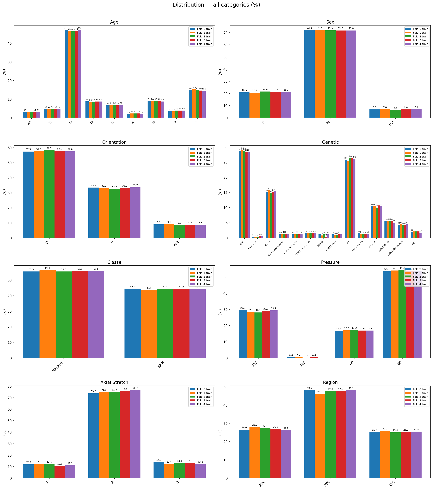
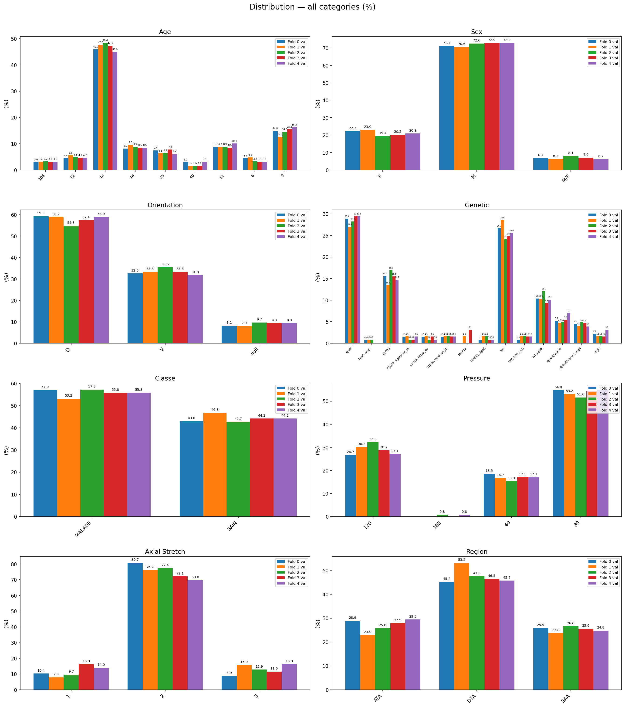
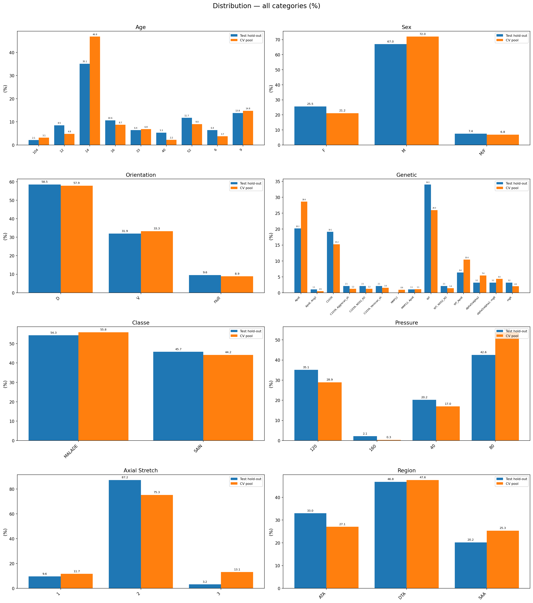

# Rapport d'experimentation -- Classification 3D par deep learning

## 0. Cadre general

### 0.1 Objectif

Le modele effectue une **classification binaire** (SAIN / MALADE) au niveau du **patch** 3D (256x256x32). Chaque patch est predit individuellement, puis les predictions sont **agregees au niveau du stack** (volume complet) par moyenne des probabilites, avec un seuil a 0.5 pour la decision finale.

### 0.2 Metriques

**F1-score par classe :**

Le F1-score est la moyenne harmonique de la precision et du recall. Il est calcule **independamment pour chaque classe** en traitant celle-ci comme la classe positive :

- **F1 SAIN** (F1 classe 0) : TP = vrais SAIN, FP = MALADE predits SAIN, FN = SAIN predits MALADE
- **F1 MALADE** (F1 classe 1) : TP = vrais MALADE, FP = SAIN predits MALADE, FN = MALADE predits SAIN

`F1 = 2 * (precision * recall) / (precision + recall)`

**Metrique principale : val_f1_mean**

La metrique utilisee pour comparer les modeles est le **val_f1_mean**, defini comme la moyenne arithmetique du F1 des deux classes :

`val_f1_mean = (F1_SAIN + F1_MALADE) / 2`

Cette metrique donne un poids egal aux deux classes, meme si le dataset est legerement desequilibre. Le meilleur modele est retenu sur la base du **best val_f1_mean** observe pendant l'entrainement (early stopping).

### 0.3 Demarche en 4 phases

1. **Phase 1 -- Evaluation du preprocessing** : fixer la strategie de preparation des donnees en comparant 9 configurations sur ResNet3D-50.
2. **Phase 2 -- Comparaison d'architectures** : evaluer 9 modeles (CNN et Transformers) sur les 2 meilleurs preprocessings.
3. **Phase 3 -- Etude de l'impact des canaux d'entree** : evaluer la contribution individuelle de chaque canal en comparant les performances single-channel vs 3-canaux.
4. **Phase 4 -- Cross-validation et test holdout** : valider les meilleurs modeles par 5-fold CV stratifiee, puis test sur un holdout jamais vu.

---

## 1. Split des donnees

### Principe

Le split est applique au niveau des **stacks** (volumes), et non des patches. Tous les patches issus d'un meme stack appartiennent au meme ensemble (train ou test), ce qui evite toute **fuite d'information** entre les ensembles.

### Pipeline de split

Chaque split est genere par un pipeline en 3 etapes :

1. **Filtrage** -- selection des stacks selon des criteres metadonnees :
   - Age (semaines) : min/max configurable
   - Region anatomique (DTA, ATA, SAA)
   - Sexe, orientation (D/V), fond genetique
   - Pression, axial stretch
   - Classe (SAIN / MALADE)

2. **Exclusion** -- retrait de stacks specifiques par identifiant (artefacts visuels, acquisitions incompletes). Exemple : `stack_000163`, `stack_000147`, `stack_000159`, `stack_000090`.

3. **Split stratifie** -- repartition en respectant les distributions sur 8 cles de stratification : age, sexe, region, axial stretch, pression, classe, orientation, fond genetique. Une graine aleatoire (seed) garantit la reproductibilite.

La sortie est un fichier JSON listant les identifiants de stacks pour chaque ensemble, avec les metadonnees du split (filtres, seed, ratios).

### Split simple (Phase 1 & 2)

Pour la comparaison des preprocessings et des architectures, un **split unique train/test (80/20)** est utilise. Plusieurs seeds ont ete testees pour evaluer la robustesse des resultats sur differents splits.

### Split cross-validation (Phase 4)

Pour la validation rigoureuse des modeles, un schema de **cross-validation stratifiee a 5 folds** avec holdout test est utilise :

**Etape 1 -- Holdout test (10%)** : 94 stacks reserves, **jamais utilises** pendant l'entrainement ni la validation. Servent uniquement a l'evaluation finale.

**Etape 2 -- Pool CV (90%)** : 643 stacks restants, repartis en 5 folds stratifies.

| Ensemble | Stacks | Utilisation |
|----------|--------|-------------|
| Test holdout | 94 | Evaluation finale uniquement |
| CV pool total | 643 | Entrainement + validation |
| Fold 0 (val) | 135 | Validation pour le fold 0, train pour les 4 autres |
| Fold 1 (val) | 126 | Validation pour le fold 1, train pour les 4 autres |
| Fold 2 (val) | 124 | Validation pour le fold 2, train pour les 4 autres |
| Fold 3 (val) | 129 | Validation pour le fold 3, train pour les 4 autres |
| Fold 4 (val) | 129 | Validation pour le fold 4, train pour les 4 autres |

Chaque fold entraine sur ~514 stacks (4/5) et valide sur ~129 stacks (1/5). Les 5 sets de validation sont **disjoints** : leur union couvre exactement les 643 stacks du pool CV.

**Distribution des classes :**
- Test holdout : 54.3% MALADE / 45.7% SAIN
- CV pool : 55.8% MALADE / 44.2% SAIN
- Ecart classe entre folds : < 3% (stratification respectee)

### Verification automatique

Un script de verification confirme :
- **Isolation** : aucun stack du holdout test n'apparait dans les folds (15 checks PASS)
- **Disjonction** : les 5 sets de validation sont mutuellement disjoints (10 checks PASS)
- **Couverture** : l'union des 5 val folds = 643 stacks exactement
- **Equilibre** : taille des folds entre 124 et 135 (moyenne 128.6, deviation max 6.4)
- **Distribution** : ecarts < 5% sur toutes les cles de stratification entre folds (sauf 2 alertes mineures sur axial stretch et region DTA)

### Visualisation des distributions

**Distribution par fold (train) :**

**Distribution par fold (validation) :**

**Distribution holdout test :**

---

## 2. Preprocessing

### 2.1 Protocole

Chaque volume 3D (NIfTI) est decoupe en patches de taille `256x256x32`.
Les patches sont initialement sauvegardes au format `.nii.gz`, puis convertis en `.npy` pour accelerer le chargement pendant l'entrainement.

**Modes d'extraction :**
- **MAX** : extrait **tous** les patches possibles du volume selon une grille 4x4, soit 16 patches. Couvre l'integralite du volume sans biais de selection.
- **TOP_N** : extrait tous les patches possibles, puis **ne retient que les N meilleurs** selon le critere de slice selection (ex: les 4 ou 8 patches avec la plus forte intensite moyenne). Reduit le volume de donnees mais peut introduire un biais.

**Deux axes d'optimisation explores :**
- **Slice selection** : methode pour choisir le meilleur bloc de 32 coupes dans le volume (intensity, intensity_range, variance, entropy)
- **Normalisation** : transformation des intensites avant extraction (z-score, min-max, robust, intensity_global, minmax_p1p99, minmax_p5p95)

### 2.2 Resultats (ResNet3D-50, validation set)

9 configurations testees, evaluees sur un split train/val unique :

| Slice Selection | Normalisation | Extraction | F1 HEALTHY | F1 DISEASED |
|----------------|---------------|------------|------------|-------------|
| **intensity** | **intensity_global** | MAX 16 | **0.954** | **0.965** |
| intensity | minmax_p5p95 | MAX 16 | 0.915 | 0.935 |
| intensity | minmax_p1p99 | MAX 16 | 0.913 | 0.933 |
| intensity | minmax_p1p99 | TOP_N 4 | 0.901 | 0.927 |
| intensity_range | min-max | MAX 16 | 0.850 | 0.884 |
| intensity_range | z-score | MAX 16 | 0.853 | 0.878 |
| intensity_range | robust | TOP_N 8 | 0.839 | 0.880 |
| variance | z-score | MAX 16 | 0.830 | 0.855 |
| entropy | z-score | MAX 16 | 0.819 | 0.851 |

### 2.3 Conclusions preprocessing

- La **slice selection par intensite** domine largement les methodes variance et entropy (+12 points F1).
- La **normalisation intensity_global** (basee sur les statistiques globales du dataset) est nettement superieure aux normalisations par-patch (z-score, min-max, robust).
- Le mode **MAX (16 patches)** est plus performant que TOP_N (4 ou 8 patches), car il couvre l'integralite du volume sans biais de selection.

**Deux configurations retenues pour la suite :**

| Preprocess | Slice Selection | Normalisation | Specificite | Justification |
|------------|----------------|---------------|-------------|---------------|
| **intensity_global** | intensity | intensity_global | Normalisation basee sur les stats globales du dataset | Meilleure performance globale |
| **minmax_p1p99** | intensity | minmax_p1p99 | Normalisation per-stack (percentiles 1/99) | Tests complementaires |

---

## 3. Comparaison des modeles

### 3.1 Configuration d'entrainement

**Entree :** patches 3x256x256x32 (3 canaux issus du preprocessing).

**Sortie :** 1 logit → sigmoide pour la probabilite SAIN/MALADE.

**Entrainement (CNN) :**
- Loss : `BCEWithLogitsLoss`
- Optimiseur : `Adam` (lr=0.001)
- 100 epochs max, early stopping (patience 20, min_delta 1e-5)
- Meilleur modele retenu selon le **best val_f1_mean** sur l'ensemble de validation

**Entrainement (Transformers, apres correction) :**
- Optimiseur : `AdamW` (lr=0.0001, weight_decay=0.05)
- Warmup lineaire 5 epochs + cosine annealing
- Gradient clipping a 1.0

**Agregation stack :** pour chaque stack, la probabilite predite est la **moyenne des probabilites** de ses patches. Decision finale : seuil a 0.5.

### 3.2 Architectures

| Modele | Type | Params | Source |
|--------|------|--------|--------|
| ResNet3D-50 | CNN residuel | 46.2M | Custom |
| ResNet3D-101 | CNN residuel | 85.2M | Custom |
| SEResNet3D-50 | CNN + Squeeze-Excitation | 48.7M | Custom |
| SEResNet3D-101 | CNN + Squeeze-Excitation | 90.0M | Custom |
| DenseNet3D-121 | Dense connections | 11.3M | MONAI |
| ConvNeXt3D-Large | CNN modernise | 210M | Custom |
| ViT3D-Base | Vision Transformer | 89.0M | Custom |
| Swin3D-Tiny | Swin Transformer | 9.8M | MONAI |
| Swin3D-Small | Swin Transformer | 38.7M | MONAI |

### 3.3 Resultats -- Train/Val split unique

#### Preprocess intensity_global -- CNN

| Modele | Best val_f1_mean | Epochs | Temps | Optimizer | Preprocess |
|--------|-----------------|--------|-------|-----------|------------|
| SEResNet3D-50 | **0.9602** | 100 (no ES) | 3h59 | Adam | intensity_global |
| SEResNet3D-101 | 0.9548 | 85 (ES) | 3h54 | Adam | intensity_global |
| DenseNet3D-121 | 0.9528 | 72 (ES) | 3h24 | Adam | intensity_global |
| ResNet3D-101 | 0.9515 | 74 (ES) | 3h17 | Adam | intensity_global |
| ResNet3D-50 | 0.9427 | 55 (ES) | 2h10 | Adam | intensity_global |

#### Preprocess minmax_p1p99 -- CNN

| Modele | Best val_f1_mean | Epochs | Temps | Optimizer | Preprocess |
|--------|-----------------|--------|-------|-----------|------------|
| SEResNet3D-101 | 0.9395 | 69 (ES) | 3h12 | Adam | minmax_p1p99 |
| SEResNet3D-50 | 0.9393 | 79 (ES) | 3h09 | Adam | minmax_p1p99 |
| ResNet3D-101 | 0.9284 | 100 (no ES) | 4h24 | Adam | minmax_p1p99 |
| ResNet3D-50 | 0.9202 | 50 (ES) | 1h57 | Adam | minmax_p1p99 |

> **Observation** : intensity_global surpasse systematiquement minmax_p1p99 pour les 4 modeles CNN testes sur les deux preprocess (+2 a +3 points F1), confirmant les resultats de la Phase 1.

#### Preprocess intensity_global -- Transformers (Adam, lr=0.001)

| Modele | Best val_f1_mean | Epochs | Temps | Optimizer | Note |
|--------|-----------------|--------|-------|-----------|------|
| ConvNeXt3D-Large | 0.9485 | 52 (ES) | 18h07 | Adam | Seul transformer a converger |
| Swin3D-Tiny | 0.3571 | 21 (ES) | 2h31 | Adam | **Bloque** -- preds constantes |
| Swin3D-Small | 0.3571 | 21 (ES) | 4h21 | Adam | **Bloque** -- preds constantes |
| ViT3D-Base | 0.3571 | 22 (ES) | 3h25 | Adam | **Bloque** -- preds constantes |

> **Diagnostic** : les transformers (sauf ConvNeXt) se sont bloques a F1=0.357 avec une loss ~0.7 plate.
> Le mecanisme d'attention est sensible aux learning rates eleves.
> ConvNeXt, bien que "modernise", reste un CNN convolutionnel pur et n'est pas affecte.

#### Preprocess intensity_global -- Transformers (AdamW + warmup + cosine annealing)

Correction appliquee : `AdamW` (weight_decay=0.05), `lr=0.0001`, warmup 5 epochs, cosine scheduler, gradient clipping 1.0.

| Modele | Best val_f1_mean | Epochs | Temps | Optimizer | Note |
|--------|-----------------|--------|-------|-----------|------|
| ConvNeXt3D-Large | **0.9606** | 100 (no ES) | ~37h | AdamW | Resume termine |
| ViT3D-Base | 0.9167 | 70 (ES) | 10h45 | AdamW | Deblocage reussi |
| Swin3D-Tiny | 0.8913 | 69 (ES) | 8h12 | AdamW | Deblocage reussi |
| Swin3D-Small | 0.8772 | 93 (ES) | 19h00 | AdamW | Deblocage reussi |

### 3.4 Synthese comparative (meilleur resultat par modele)

| Rang | Modele | val_f1_mean | Epochs | Temps | Batch size | GPU | Optimizer | Params |
|------|--------|------------|--------|-------|------------|-----|-----------|--------|
| 1 | ConvNeXt3D-Large | **0.9606** | 100 | ~37h | 32 | 80GB | AdamW | 210M |
| 2 | SEResNet3D-50 | 0.9602 | 100 | 3h59 | 32 | 40GB | Adam | 48.7M |
| 3 | SEResNet3D-101 | 0.9548 | 85 | 3h54 | 24 | 40GB | Adam | 90.0M |
| 4 | DenseNet3D-121 | 0.9528 | 72 | 3h24 | 16 | 40GB | Adam | 11.3M |
| 5 | ResNet3D-101 | 0.9515 | 74 | 3h17 | 24 | 40GB | Adam | 85.2M |
| 6 | ResNet3D-50 | 0.9427 | 55 | 2h10 | 32 | 40GB | Adam | 46.2M |
| 7 | ViT3D-Base | 0.9167 | 70 | 10h45 | 8 | 80GB | AdamW | 89.0M |
| 8 | Swin3D-Tiny | 0.8913 | 69 | 8h12 | 8 | 80GB | AdamW | 9.8M |
| 9 | Swin3D-Small | 0.8772 | 93 | 19h00 | 4 | 80GB | AdamW | 38.7M |

> GPU = H100 MIG 40GB ou H100 complète 80GB.

> **Observation** : ConvNeXt3D-Large obtient le meilleur F1 global (0.9606) mais necessite 37h et un GPU 80GB.
> SEResNet3D-50 atteint un F1 quasi equivalent (0.9602) avec Adam en moins de 4h sur un GPU 40GB.
> DenseNet3D-121 offre le meilleur ratio perf/taille (0.9528 avec seulement 11.3M params).
> Les modeles CNN classiques (ResNet, SEResNet) sont robustes et stables avec un optimizer simple (Adam).
> Les transformers necessitent un tuning specifique (AdamW, warmup, scheduler) pour converger.

---

## 4. Etude single-channel

### 4.1 Motivation

Dans la section 3, tous les modeles recoivent des patches a **3 canaux** d'entree `(3, 32, 256, 256)`, issus du preprocessing.

Cette configuration souleve une question : **les 3 canaux contribuent-ils de maniere egale a la classification, et un seul canal suffit-il a atteindre des performances comparables ?**

L'objectif de cette etude est de :
- Determiner si un canal porte plus d'information discriminante que les autres
- Comparer les resultats single-channel aux resultats 3-canaux de reference

**Choix des modeles :** les architectures SEResNet sont volontairement exclues de cette etude. Le mecanisme Squeeze-and-Excitation repose precisement sur une **ponderation adaptative inter-canaux** : il apprend a recalibrer l'importance relative de chaque canal de features. Avec un seul canal en entree, ce mecanisme perd son interet et ne peut pas s'exprimer, ce qui fausserait la comparaison. Les 3 modeles retenus (ResNet3D-50, ResNet3D-101, DenseNet3D-121) n'ont pas de dependance architecturale au nombre de canaux.

### 4.2 Protocole

- **Entree** : les patches preprocesses ont une dimension `(3, 32, 256, 256)`. On selectionne un **unique canal** (canal 0, 1 ou 2) pour obtenir un tenseur `(1, 32, 256, 256)` passe au modele.
- **Modeles retenus** : ResNet3D-50, ResNet3D-101, DenseNet3D-121
- **Variantes** : 3 par modele (ch0, ch1, ch2)
- **Preprocess** : intensity_global (identique aux runs principaux)
- **Split** : meme split train/val que les runs single-split de la section 3
- **Entrainement** : parametres identiques aux CNN de la section 3 (Adam, lr=0.001, 100 epochs max, early stopping patience 20)

### 4.3 Resultats

| Modele | Canal 0 | Canal 1 | Canal 2 | 3 canaux (ref) |
|--------|---------|---------|---------|----------------|
| ResNet3D-50 | 0.7967 | 0.7567 | 0.9009 | 0.9427 |
| ResNet3D-101 | 0.8149 | 0.8145 | 0.8985 | 0.9515 |
| DenseNet3D-121 | 0.8577 | 0.9009 | **0.9476** | 0.9528 |

> La colonne "3 canaux (ref)" reprend les meilleurs resultats de la section 3.3 (intensity_global, CNN) pour comparaison directe.

### 4.4 Analyse

- Le **canal 2** est systematiquement le meilleur pour les 3 modeles, avec un ecart important par rapport aux canaux 0 et 1 (+5 a +14 points F1).
- **DenseNet3D-121 sur canal 2** atteint **0.9476**, quasi equivalent a la reference 3-canaux (0.9528, soit -0.5 points). Cela montre que le canal 2 porte la quasi-totalite de l'information discriminante.
- Le gain apporte par les 3 canaux combines reste reel mais modeste parfois : DenseNet3D-121 (+0.5 points), ResNet3D-50 (+4.2 points) et ResNet3D-101 (+5.3 points).

---

## 5. Cross-validation (5-fold)

### 5.1 Protocole

- **10% holdout test** : 94 stacks reserves, jamais utilises pendant l'entrainement
- **90% restants** : 643 stacks repartis en 5 folds stratifies (age, sexe, region, etc.)
- Chaque fold entraine sur 4/5 des 643 stacks, valide sur 1/5
- Preprocess : **intensity_global**
- CNN entraines avec **Adam, lr=0.001** ; ConvNeXt3D-Large avec **AdamW, lr=0.0001, warmup + cosine**
- Batch size variable selon l'architecture

### 5.2 Resultats par fold (val_f1_mean)

| Modele | Fold 0 | Fold 1 | Fold 2 | Fold 3 | Fold 4 | Moyenne | Ecart-type |
|--------|--------|--------|--------|--------|--------|---------|------------|
| DenseNet3D-121 | 0.9639 | 0.9616 | 0.9529 | **0.9668** | 0.9162 | **0.9523** | 0.0186 |
| ConvNeXt3D-Large | 0.9495 | 0.9601 | 0.9440 | **0.9648** | 0.9351 | **0.9507** | 0.0107 |
| ResNet3D-101 | 0.9483 | 0.9683 | 0.9430 | **0.9791** | 0.8953 | **0.9468** | 0.0289 |
| ResNet3D-50 | 0.9579 | **0.9647** | 0.9498 | 0.9633 | 0.8955 | **0.9462** | 0.0273 |
| SEResNet3D-101 | 0.9556 | 0.9611 | 0.9381 | **0.9622** | 0.9078 | **0.9450** | 0.0205 |
| SEResNet3D-50 | 0.9526 | **0.9581** | 0.9313 | 0.9561 | 0.9265 | **0.9449** | 0.0143 |

> Modeles tries par F1 mean decroissant.

### 5.3 Synthese

| Rang | Modele | F1 mean | Ecart-type | Meilleur fold | Pire fold | Temps total |
|------|--------|---------|------------|---------------|-----------|-------------|
| 1 | DenseNet3D-121 | **0.9523** | 0.0186 | Fold 3 (0.9668) | Fold 4 (0.9162) | ~9h49 |
| 2 | ConvNeXt3D-Large | 0.9507 | 0.0107 | Fold 3 (0.9648) | Fold 4 (0.9351) | ~80h18 |
| 3 | ResNet3D-101 | 0.9468 | 0.0289 | Fold 3 (0.9791) | Fold 4 (0.8953) | ~9h40 |
| 4 | ResNet3D-50 | 0.9462 | 0.0273 | Fold 1 (0.9647) | Fold 4 (0.8955) | ~8h31 |
| 5 | SEResNet3D-101 | 0.9450 | 0.0205 | Fold 3 (0.9622) | Fold 4 (0.9078) | ~14h02 |
| 6 | SEResNet3D-50 | 0.9449 | 0.0143 | Fold 1 (0.9581) | Fold 4 (0.9265) | ~8h27 |

> **Observations :**
> - **DenseNet3D-121** arrive en tete de la CV (0.9523) avec seulement 11.3M params -- meilleur ratio perf/taille et meilleure generalisation.
> - **ConvNeXt3D-Large** se place 2e (0.9507) mais un temps total de ~80h (10x plus que DenseNet).
> - Le **fold 4** est systematiquement le plus faible pour les 6 modeles, suggerant une distribution de donnees plus difficile dans ce fold.
> - Le **fold 3** est le meilleur pour 4 modeles sur 6, le **fold 1** pour les 2 autres.

---

## 6. Test sur holdout (94 stacks)

### 6.1 Protocole

Le pipeline de test utilise les **5 checkpoints** issus de la cross-validation (1 par fold) pour evaluer un modele sur les **94 stacks holdout** (1459 patches au total).

**Etape 1 -- Inference par patch :** chaque patch est passe individuellement dans chacun des 5 modeles. Chaque modele produit un logit, transforme en probabilite via sigmoide. On obtient donc, pour chaque patch, **5 probabilites** (une par fold).

**Etape 2 -- Ensemble des modeles :** pour chaque patch, les 5 probabilites sont moyennees pour produire une **probabilite ensemble** unique par patch.

**Etape 3 -- Agregation par stack :** tous les patches appartenant a un meme stack sont regroupes. La probabilite finale du stack est la **moyenne arithmetique** des probabilites ensemble de ses patches. Par exemple, un stack avec 16 patches aura sa probabilite calculee comme `p_stack = mean(p_patch_1, p_patch_2, ..., p_patch_16)`.

**Etape 4 -- Decision :** un seuil fixe a **0.5** est applique sur la probabilite du stack. Si `p_stack >= 0.5`, le stack est predit MALADE, sinon SAIN.

**Metriques :** F1 mean (moyenne du F1 SAIN et F1 MALADE), Accuracy, AUC (aire sous la courbe ROC, calculee sur les probabilites continues avant seuillage), et matrice de confusion.

### 6.2 Resultats -- Ensemble (5 modeles)

| Rang | Modele | F1 mean | Accuracy | AUC | Erreurs (sur 94) |
|------|--------|---------|----------|-----|------------------|
| 1 | **ResNet3D-101** | **0.9785** | 0.9787 | 0.9913 | 2 FP |
| 1 | **DenseNet3D-121** | **0.9785** | 0.9787 | 0.9927 | 2 FP |
| 3 | SEResNet3D-101 | 0.9678 | 0.9681 | **0.9964** | 2 FP + 1 FN |
| 3 | SEResNet3D-50 | 0.9679 | 0.9681 | 0.9927 | 2 FP + 1 FN |
| 5 | ResNet3D-50 | 0.9676 | 0.9681 | 0.9891 | 3 FP |
| 6 | ConvNeXt3D-Large | 0.9567 | 0.9574 | 0.9923 | 4 FP |

> **Observations :**
> - **ResNet3D-101** et **DenseNet3D-121** partagent la 1ere place avec F1=0.9785 et seulement 2 erreurs (faux positifs).
> - **SEResNet3D-101** obtient le meilleur **AUC** (0.9964), signe de la meilleure calibration des probabilites.
> - DenseNet3D-121 egalise ResNet3D-101 avec **18x moins de parametres** (11.3M vs 85.2M).
> - **ConvNeXt3D-Large**, malgre ses 210M params et son excellent F1 en single-split (0.9606), se place dernier sur le holdout (0.9567, 4 FP) -- signe d'un possible overfitting.

### 6.3 Confusion matrices

**ResNet3D-101 / DenseNet3D-121 (identiques) :**

|  | Pred SAIN | Pred MALADE |
|--|-----------|-------------|
| **Vrai SAIN** | 41 | 2 |
| **Vrai MALADE** | 0 | 51 |

**SEResNet3D-50 / SEResNet3D-101 (identiques) :**

|  | Pred SAIN | Pred MALADE |
|--|-----------|-------------|
| **Vrai SAIN** | 41 | 2 |
| **Vrai MALADE** | 1 | 50 |

**ResNet3D-50 :**

|  | Pred SAIN | Pred MALADE |
|--|-----------|-------------|
| **Vrai SAIN** | 40 | 3 |
| **Vrai MALADE** | 0 | 51 |

**ConvNeXt3D-Large :**

|  | Pred SAIN | Pred MALADE |
|--|-----------|-------------|
| **Vrai SAIN** | 39 | 4 |
| **Vrai MALADE** | 0 | 51 |

### 6.4 Stacks problematiques

Certains stacks sont systematiquement mal classes par tous les modeles :

| Stack | Label reel | Comportement |
|-------|-----------|-------------|
| **stack_000754** | SAIN | Predit MALADE par les 6 modeles (proba 0.92--0.97). Faux positif recurrent. |
| **stack_000708** | SAIN | Predit MALADE par 5/6 modeles (proba 0.69--0.87). Faux positif limite. |

> Ces stacks meritent une inspection visuelle pour verifier la qualite des annotations ou detecter des artefacts.

### 6.5 TODO

- [ ] CV + holdout pour ViT3D-Base (CV en cours)
